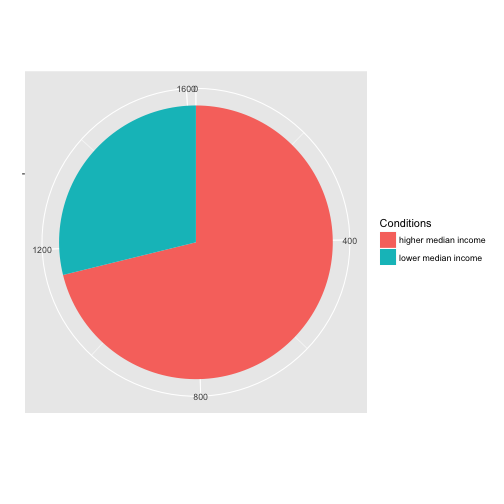

# Background
Given the median salary of locations in United States and using web scraping tools in R such as "Rvest", this task requires a statistical analysis based on data to determine if Target should open a store in Terre Haute area. The data of median house income is provided by instructor and the number of Target stores at locations are scrabed from online. 

# Approach
The ensential skills required for complishing this task is to properly scrape information from website and cleaning data for usage. R Packages such as "Rvest" and "stringr" are used to accomplish web scraping and data cleaning. The Target store infomation of each state is obtained in every iterations of the for loop. The state's corresponding url is created by combining two base url components and state name. Then, after identifying the html class containing desired informations, functions form "rvest" are called to extract information as in pure text. String manipulations are applied to the text to clean into a nice dataframe which can be used later. 


```r
# set base urls
base_url1 <- "http://www.allstays.com/c/target-"
base_url2 <- "-locations.htm"

df_stores <- data.frame() # dataframe containing information of zipcode where is at least a Target Store

# iterate over states' abbreviations
for (state_brev in state.abb){
  state<-state.name[grep(state_brev,state.abb)]     # get state name based on abbreviation
  state <- tolower(state)                           # change state name to lower case
  state <- sub(" ","-",state)                       # add "-" to state name
  url <- paste(base_url1,state,base_url2,sep = "")  # construct URL
  html<- read_html(url)                             # read html
  
  txt <-html_nodes(html,".col-md-5") %>% html_text() # extract texts from specific html class
  all_zips <- as.vector(str_extract_all(txt,paste(state_brev,"[0-9][0-9][0-9][0-9][0-9]"))) #extract zipcode
  to_remove = paste(state_brev,"")
  all_zips <- gsub(to_remove,"",unlist(all_zips))   # remove state abbreviation in the zipcode
  df_state <- as.data.frame(table(all_zips))        # construct datafrome for zipcodes which has Target Store
  df_stores<- rbind(df_stores,df_state)             # attach result to final output df
}
names(df_stores) <- c("ZipCode","#stores")        # rename column names
save(df_stores,file = "target_info.Rda")          # save result
```
After obtaing alll informations of targets at 50 states of united states, the result is merged with the informations of median income by zipcode. 

```r
income_df = read.csv("input/ACS_14_5YR_B19013_with_ann.csv",skip =1)
# rename some columns
colnames(income_df)[4]<-"estimate_median"
colnames(income_df)[5]<-"marginal_error"

income_df$Geography=gsub("ZCTA5 ","" ,income_df$Geography) #cleaning zipcode column
income_df$Geography = as.factor(income_df$Geography)       # change data types to factor
income_df$estimate_median = as.numeric(income_df$estimate_median) # change data types to numerical

df_income <- income_df[c("Geography","estimate_median")]
names(df_income) <- c("ZipCode","est_income_median")

load("target_info.Rda") # import Target store information
df_gen <- merge(df_income,df_stores,by="ZipCode",all = TRUE)
```

# Result
After acquired all necessary information, the criteria for determination of whether Target should open a store in Terre Haute area is to compare number of stores where median income exceeds Terre Haute area and the number of stores where median income does not exceed Terre Haute. 


```r
TH_median <- df_gen$est_income_median[df_gen$ZipCode==47803]    # median income of Terre Haute

# number of Target where median is lower higher
store_higher_median <- sum(df_gen$est_income_median>TH_median & df_gen$`#stores`>0,na.rm=TRUE)
# number of Target where median income is lower
store_lower_median <- sum(df_gen$est_income_median<TH_median & df_gen$`#stores`>0,na.rm=TRUE)
```

Number of Target stores where median income exceeds Terre Haute:

```
## [1] 1150
```

Number of Target stores where median income does not exceed Terre Haute:

```
## [1] 466
```
Considering there are over 400 current openning Target stores are located where median income is lower than Terre Haute area, if median income is the only factor for the decision making, it will probably be profitable for Target to open a store in Terre Haute area.

#### Graph
Based on the number of locations where has targets, a pie plot is generated to have a better visualizaiton of ratio between the locations where median income is higher or lower than Terre Haute.





As it can be shown on the pie plot, there are roughly over 30% of targets are opened in the area where median income is lower than Terre Haute. Based on a significant amount of Targets open in those area with lower incomes, one should be open in Terre Haute.

# Reflection
Accomplishing this project requires basic knowledge of html structure and rvest library. The most time-consuming part of this project is to identify the desired html node from viewing the webpage source code. In order to filting the zipcode, I learned regular expression to perform the string matching function in "stringr" library.

#### Limitations
Idealy, the number of locations where do not have Target should be taken into consideration as well. However, even though the income information of all location is provided in the dataset, information on the population and other geographical information are not provided. Without those crusial informations, a bias can be generated because many locations with low population do not have targets. Therefore, an inspection of locations without Target is not conducted based on limited recourses. 


# Full Code

```r
library(readr)
library(rvest)
library(jsonlite)
library(httr)
library(xml2)
library(stringr)

# set base urls
base_url1 <- "http://www.allstays.com/c/target-"
base_url2 <- "-locations.htm"

df_stores <- data.frame() # dataframe containing information of zipcode where is at least a Target Store

# iterate over states' abbreviations
for (state_brev in state.abb){
  state<-state.name[grep(state_brev,state.abb)]     # get state name based on abbreviation
  state <- tolower(state)                           # change state name to lower case
  state <- sub(" ","-",state)                       # add "-" to state name
  url <- paste(base_url1,state,base_url2,sep = "")  # construct URL
  html<- read_html(url)                             # read html
  
  txt <-html_nodes(html,".col-md-5") %>% html_text() # extract texts from specific html class
  all_zips <- as.vector(str_extract_all(txt,paste(state_brev,"[0-9][0-9][0-9][0-9][0-9]"))) #extract zipcode
  to_remove = paste(state_brev,"")
  all_zips <- gsub(to_remove,"",unlist(all_zips))   # remove state abbreviation in the zipcode
  df_state <- as.data.frame(table(all_zips))        # construct datafrome for zipcodes which has Target Store
  df_stores<- rbind(df_stores,df_state)             # attach result to final output df
}
names(df_stores) <- c("ZipCode","#stores")        # rename column names
save(df_stores,file = "target_info.Rda")          # save result


income_df = read.csv("input/ACS_14_5YR_B19013_with_ann.csv",skip =1)
# rename some columns
colnames(income_df)[4]<-"estimate_median"
colnames(income_df)[5]<-"marginal_error"

income_df$Geography=gsub("ZCTA5 ","" ,income_df$Geography) #cleaning zipcode column
income_df$Geography = as.factor(income_df$Geography)       # change data types to factor
income_df$estimate_median = as.numeric(income_df$estimate_median) # change data types to numerical

df_income <- income_df[c("Geography","estimate_median")]
names(df_income) <- c("ZipCode","est_income_median")

load("target_info.Rda") # import Target store information
df_gen <- merge(df_income,df_stores,by="ZipCode",all = TRUE)

TH_median <- df_gen$est_income_median[df_gen$ZipCode==47803]    # median income of Terre Haute


# number of Target where median is lower higher
store_higher_median <- sum(df_gen$est_income_median>TH_median & df_gen$`#stores`>0,na.rm=TRUE)
# number of Target where median income is lower
store_lower_median <- sum(df_gen$est_income_median<TH_median & df_gen$`#stores`>0,na.rm=TRUE)

groups <- c("higher median income","lower median income")
info <- rbind(store_higher_median,store_lower_median)
df_tem <- data.frame(groups,info)    # create data frame for plot usage

g <- ggplot(df_tem,aes(x="",y=info,fill=groups))+geom_bar(width = 1,stat = "identity") # construct bar plot
g <- g+guides(fill=guide_legend(title="Conditions"))+xlab("")+ylab("")      # set labels
g <- g+coord_polar("y",start=0)              # change to polar coordinate system
g
```

